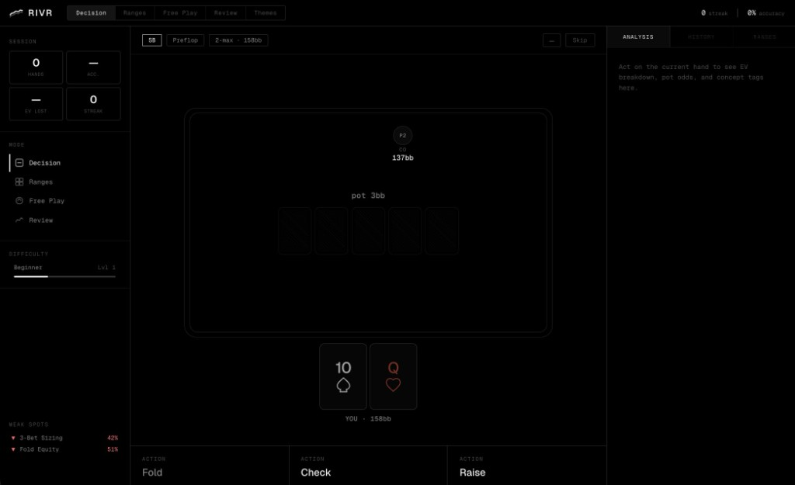

# rivr

A math-first poker decision trainer for Texas Hold'Em. rivr generates procedural game states and adjudicates user actions against expected value, equity, and pot odds — not heuristics or opinion.



## Why rivr

The poker feedback loop is structurally broken. Static tools (charts, solvers) teach correctness but offer no practice. Actual play gives practice but almost no reliable feedback — outcomes are noisy, spots are unrepeatable, and bad decisions still win. rivr closes the gap with a flashcard-style training loop: procedurally generated hands, immediate EV-grounded feedback, and concept-tagged analytics.

## Architecture

```
Browser (React 19 + Zustand)
  │
  │  fetch /api/scenario/generate
  │  fetch /api/scenario/adjudicate
  ▼
Express API (port 3001)
  │
  ├── scenarioGenerator — procedural game state creation
  │     position, street, stack depth, villain ranges, action history
  │
  └── adjudication engine
        equity (Monte Carlo, 10k iterations) → pot odds → SPR → fold equity → EV by action
```

The Vite dev server proxies `/api` to the Express backend. The adjudication engine runs synchronously on the server; a Web Worker path exists for client-side equity calculation when needed.

Villain ranges are held server-side in memory (keyed by scenario UUID) and stripped from client payloads to prevent information leakage.

### Tech Stack

| Layer | Technology |
|---|---|
| Frontend | Vite 8, React 19, TypeScript |
| State | Zustand |
| Animation | Framer Motion, CSS 3D transforms |
| Server | Express 5, Node.js |
| Equity engine | Monte Carlo simulation (10,000 iterations) |
| Hand evaluation | pokersolver |
| Testing | Vitest |

## Modes

**Decision Mode** — The core training loop. Face a fully specified game state (position, street, stack depth, pot, action history) and choose the mathematically correct action. Every hand is a flashcard — fold, check, call, or raise to the correct size.

**Range Trainer** — Preflop hand selection drills. Classify opening, 3-bet, and calling ranges by position. Visual 13×13 range matrix with hand highlighting.

**Free Play** — Full simulated hands from preflop to showdown against archetype opponents (TAG, LAG, LP, Nit). Same engine as Decision Mode; stats count toward your session.

**Session Review** — Hand history timeline with street-by-street action logs. Accuracy breakdowns by street, position, concept tag, and difficulty. Weak spot surfacing with drill suggestions.

## Feedback System

Every decision produces:

- **Verdict** — Correct / Incorrect with EV differential
- **EV breakdown** — Numerical EV for fold, check/call, and raise
- **Pot odds** — Required equity vs. actual equity
- **Concept tags** — Pot Odds, Equity, SPR, Fold Equity, 3-Bet, C-Bet, Mixed Strategy
- **Mixed strategy disclosure** — When two actions are within ±0.5bb EV, both are accepted with GTO frequency split

Raise sizing is evaluated against tolerance windows (±15% standard, exact for all-in, ±20% for mixed spots).

## Adaptive Difficulty

| Level | Label | Scope |
|---|---|---|
| 1 | Beginner | Preflop only, deep stacks (100bb+), heads-up, clear-cut EV |
| 2 | Intermediate | Flop/turn, 2–4 players, moderate SPR, standard boards |
| 3 | Advanced | All streets, multi-way pots, complex textures, mixed strategy spots |

## Theming

Four built-in themes switchable via CSS custom properties (no reload):

- **Dark Minimal** — Matte black surfaces, red accent
- **Paper White** — Linen card texture, navy accent
- **Felt Green** — Casino felt table, gold accent
- **Neon / Cyberpunk** — Deep black, neon green accent with pink hearts and cyan diamonds

## Getting Started

### Prerequisites

- Node.js 20+
- npm

### Install & Run

```bash
git clone https://github.com/mariosumali/rivr.git
cd rivr
npm install
```

Start the backend and frontend in separate terminals:

```bash
# Terminal 1 — API server
npm run server

# Terminal 2 — Vite dev server
npm run dev
```

The API runs on `http://localhost:3001` and the frontend on `http://localhost:5173`. Vite proxies `/api` requests to the backend automatically.

### Build

```bash
npm run build
npm run preview
```

### Test

```bash
npm test
```

## API

### `POST /api/scenario/generate`

Generate a random game state for training.

**Body:**
```json
{
  "difficulty": 1,
  "street": "preflop",
  "position": "CO"
}
```

`street` and `position` are optional. Returns a `scenario` object (hero hand, community cards, pot, stack depth, action history) and a `scenarioId` for adjudication.

### `POST /api/scenario/adjudicate`

Submit a user action against a generated scenario.

**Body:**
```json
{
  "scenarioId": "uuid",
  "userAction": "call",
  "userSizing": 7.5,
  "difficulty": 1
}
```

Returns verdict, EV by action, recommended action, sizing range, concept tags, hero equity, pot odds, and mixed strategy data.

## Project Structure

```
rivr/
├── server/
│   ├── index.ts               # Express API routes
│   └── scenarioGenerator.ts   # Procedural game state generation
├── src/
│   ├── engine/
│   │   ├── types.ts            # Core types (Card, GameState, AdjudicationResult)
│   │   ├── adjudication.ts     # EV calculation, action ranking, sizing tolerance
│   │   ├── equity.ts           # Monte Carlo equity simulation
│   │   ├── handEvaluator.ts    # 5/7-card hand evaluation
│   │   ├── equityWorker.ts     # Web Worker for non-blocking equity calc
│   │   └── __tests__/          # Engine unit tests
│   ├── store/
│   │   └── gameStore.ts        # Zustand store (game phase, scenarios, history)
│   ├── components/
│   │   ├── PokerTable.tsx      # Table layout with player positions
│   │   ├── Card.tsx            # CSS 3D card with deal/flip/fold animations
│   │   ├── PlayerSeat.tsx      # Player avatar, stack, position indicator
│   │   ├── CommunityCards.tsx  # Board cards with staged reveal
│   │   ├── ActionPanel.tsx     # Fold / Check / Call / Raise controls
│   │   ├── FeedbackPanel.tsx   # Post-decision EV breakdown
│   │   ├── shell/              # TopBar, Sidebar navigation
│   │   └── views/              # RangeTrainer, Review, Themes views
│   ├── styles/
│   │   ├── global.css          # Layout and base styles
│   │   └── themes.css          # CSS custom property theme definitions
│   └── theme/
│       └── themeController.ts  # Theme persistence and hydration
└── vite.config.ts              # Vite + Vitest config with API proxy
```

## License

MIT
